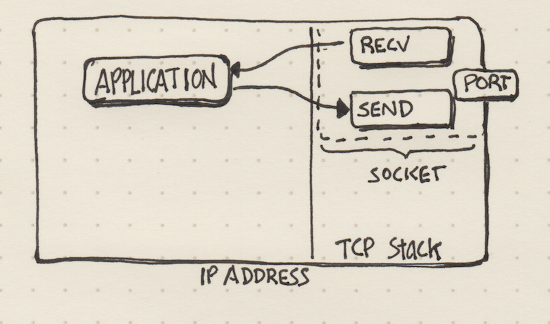
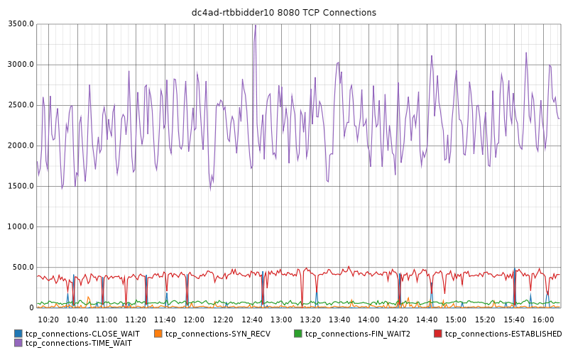
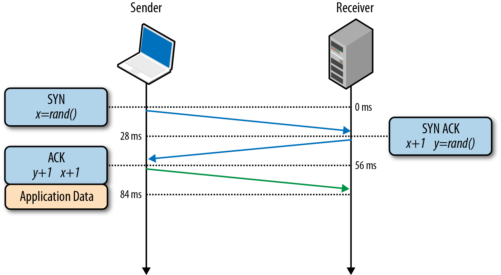
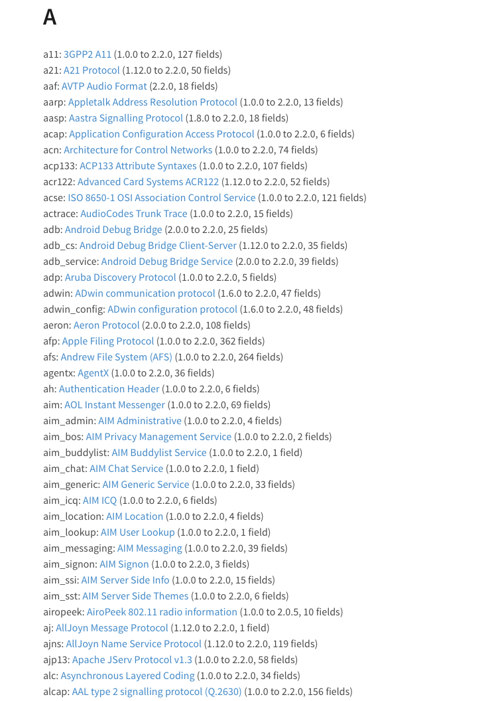
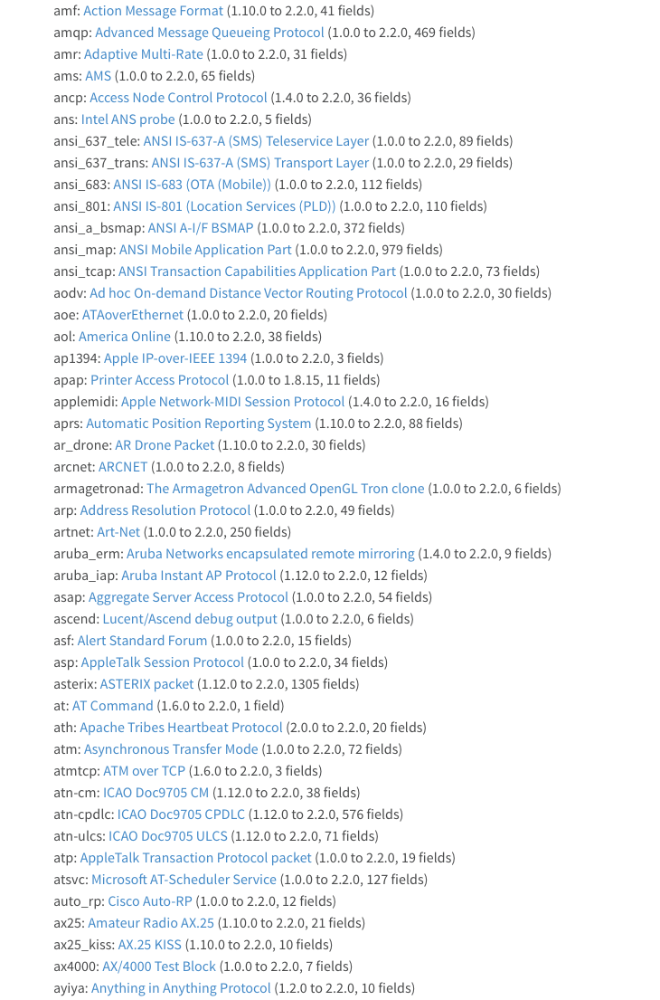
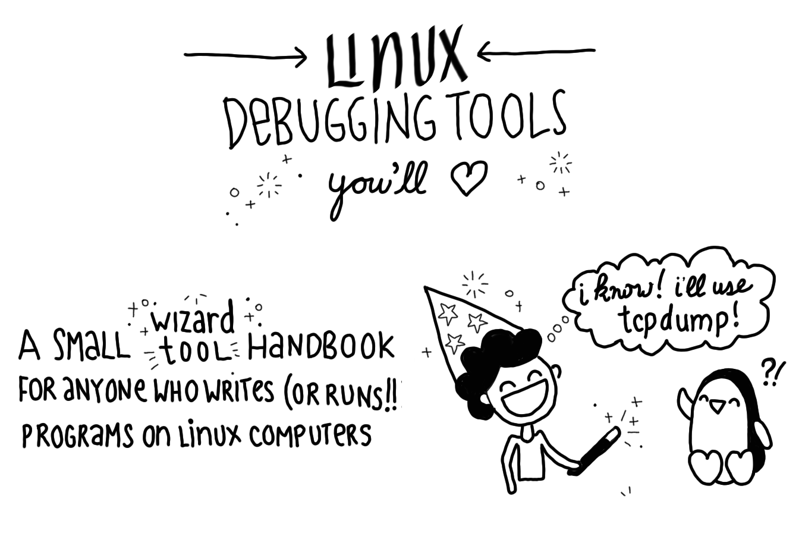

# Seeing the Matrix
## (with **tcpdump** and **friends**)

Vermont Code Camp, Sep. 17 2016
David Howell
**@dehowell** on  and 

---


^This is tcpdump in action - it's where we're headed today.

---

# [fit] Who Am I?

## Technical Lead at **Dealer.com**

### I work on a **real-time bidding** system that gets **hundreds of thousands** of requests per second and has to respond in less than **100 milliseconds**.

^At our scale, all kinds of things can have weird consequences - including the networking stack.

---

# [fit] **Protocols**

> a **communication protocol** is a system of rules that allow two or more entities of a communications system to transmit information via any kind of variation of a physical quantity.[^1]


[^1]: "[Communications protocol](https://en.wikipedia.org/wiki/Communications_protocol)". *Wikipedia: the Online Encyclopedia.*

^We have protocols because we need to agree on how we interpret the changing voltage on a wire as a signal.

---

# [fit] Application **Protocols**

HTTP(S)
MySQL
MongoDB
AMQP (RabbitMQ)
SSH

^These are some protocols that you have probably encountered, which all define some kind of request and response formats between a client and a server.

^They don't handle _machine addresses_. They assume that their messages arrive intact, with no missing pieces or errors, regardless of length. They can just say "This chunk of bits is a message! Here ya go!" and trust.

---

# **T**ransmission
# **C**ontrol
# **P**rotocol

^They get those features by virtue of being built on top of TCP.

^TCP handles chunking bits into _packets_, ordering the packets, doing checksums to catch errors, and all the messy details of keeping the abstraction clean for the application protocol.

^When we're lucky, we use web servers and libraries that deal with TCP and everything just works! But then there are other times...

---

> **Umm,** is something wrong with the network?
-- Me, grasping at straws while troubleshooting **production issues.**

^I got tired of asking this hand-wavey question and feeling like a ding-dong. I'm far from an expert, but learning the basics of network troubleshooting has helped me ask way better questions of the systems engineers I work with and get to the bottom of issues faster.

^My goal today is to teach you just enough TCP theory and some practical tools so that you can do the same.

---

# Graphite says my app is **fast**, but a client say that it's **slow!**

^Most libraries that provide response timing for web applications start their timers only after a complete HTTP request has made it into your code.

^But the TCP packets that make up the request can be queued in your operating system for a long time before that ever happens!

---

# Why did Solr get so **slow?**

^At Dealer.com, we use Apache Solr for full-text search over vehicles on our dealership sites. We had a release that unintentionally switched our Solr client from using binary serialization to XML.

^It wasn't obvious from looking at the diff of what changed in the code, but the volume of network traffic jumped substantially for the same number of requests -- XML is big. Would have been totally obvious if we looked at TCP packets.

---

# What is a TCP connection made of?



^Well, there are two sides to the connection - the client and the server. On each side, there's a socket, managed by the TCP stack in the operating system. For each port, the OS manages the send and receive buffers for incoming and outgoing packets, and there is _state_ for managing the connection. To the process using the socket, those buffers are its input and output streams.

---

# [fit] Addresses

## client `10.0.1.10:58012`

## server `108.160.172.206:443`

^This is what the addresses look like - in TCP conns, we have both the IP address and the port. These are the two halves of a Dropbox connection from my laptop.

^Servers are expected to listen on standard ports - the so called "well known address" for the service. 8080 is a fairly standard choice for HTTP services internal to a data center.

^The client side needs to have a port open as well, so that the server has an address to send responses to. The client side port is open for the duration of the connection and is allocated out of a pool of unused high ports.

---


^This is the state machine that governs TCP connections - the OS keeps track of the connection state and manages transitions. Most of the time should be spent in ESTABLISHED - that's where the application protocol can get its work done. I'll refer back to this later, but I wanted to take a quick look at it now.

^The red paths are the client transitions and the blue are for the server... time goes from top to bottom in this picture.

---

# **ss** and **netstat**

^Let's get into some practical stuff. ss and netstat are both tools that you can use to inspect those data structures on your OS.

^netstat is older and slower and the only option available on OS X. ss is the way to go on Linux. Both have similar output.


---

```
$ ss -n

State      Recv-Q Send-Q        Local Address:Port          Peer Address:Port
ESTAB      0      0               10.16.48.53:36555       204.152.51.176:3306
```

^Let's dissect this - first off anyone want to guess what this represents?

^First column is the state - this connection is in the ESTABLISHED. I'll go into a little bit more detail about the TCP states later. Next column is the receive queue - this is the number of bytes that have arrived but haven't yet been read by the application.

^Then the send queue - these are bytes flushed to the socket by your application but not yet sent off the box. These numbers should typically be less than 1500 bytes, because that's about the size of a packet. If you see larger numbers in the queues, then data is backing up in the operating system's networking stack.

---



^At Dealer.com, we use a plugin for collectd to scrape summaries of socket states and pipe it into Graphite. It can be really helpful to see time-series of connection states - especially because each connection also consumes a UNIX file handle, and there are a finite number of those available per process! A misbehaving client can burn through sockets on your server in a denial of service attack.

---

# [fit] **TCP** States

**LISTEN**
**ESTABLISHED**
**CLOSE-WAIT**
**TIME-WAIT**

^LISTEN: waiting for a connection to start
^ESTABLISHED: let's get some work done
^CLOSE-WAIT: waiting for the application to say goodbye
^I CAN'T HEAR YOU: connections go into TIME-WAIT to ignore packets that arrive after the connection is supposed to be shut down - if the port was reused right away, the server might get confused by those stray packets

---


# What's in a TCP **packet?**

^Now it's time to dig into the contents of individual packets.

---


# TCP Packet Layout

- sequence number / acknowledgement number
- control bits

^This is how a TCP packet is laid out. We talked about the ports already... note that the IP addresses aren't present in the TCP segment, because this data is nested inside an IP packet and that's where the IP addresses live. IP is about getting the packet to the server and TCP is about getting it to the application.

^The features I want to talk about right now are the seq/ack numbers, and the control bits. But while we're here - notice that last field labeled DATA. That's where all the application protocol stuff lives. For an HTTP request, the first few bytes of that field would say "GET" or one of the other HTTP verbs.

^The control bits are indicating TCP state machine transitions.

^The seq/ack numbers are used to keep track of position in the stream of incoming packets. Packets are sent individually, so could potentially be routed along different paths and arrive out of order. These are almost like page numbers - they let the network stack reconstruct the original order of the packets.

^Let's look at a concrete example of how the control flags and sequence numbers are used.

---

# Opening a Connection[^2]

[^2]: Diagram from _High Performance Browser Networking_.



^This is what happens when a TCP connection is opened.
^WALK THROUGH DIAGRAM
^"Now the client and server agree on their sequence numbers and can proceed with application data"


---

# **tcpdump**

```
$ sudo tcpdump -i any -c 10000 -w cms.pcap
```

```
18:47:25.173867 IP 64.70.56.67.6461 > 10.14.9.16.7070: Flags [F.], seq 1416611227, ack 2684941500, win 65535, options [nop,nop,TS val 629964532 ecr 1941132797], length 0
18:47:25.173987 IP 10.14.9.16.7070 > 64.70.56.67.6461: Flags [F.], seq 1, ack 1, win 20272, options [nop,nop,TS val 1941133797 ecr 629964532], length 0
18:47:25.174207 IP 64.70.56.67.6461 > 10.14.9.16.7070: Flags [.], ack 2, win 65535, options [nop,nop,TS val 629964533 ecr 1941133797], length 0
18:47:25.200164 IP 64.70.56.67.53746 > 10.14.9.16.7070: Flags [S], seq 2174566585, win 4380, options [mss 1460,nop,nop,TS val 629964558 ecr 0,sackOK,eol], length 0
18:47:25.200174 IP 10.14.9.16.7070 > 64.70.56.67.53746: Flags [S.], seq 4150933547, ack 2174566586, win 14480, options [mss 1460,sackOK,TS val 1941133824 ecr 629964558], length 0
18:47:25.200498 IP 64.70.56.67.53746 > 10.14.9.16.7070: Flags [.], ack 1, win 4380, options [nop,nop,TS val 629964559 ecr 1941133824], length 0
18:47:25.200513 IP 64.70.56.67.53746 > 10.14.9.16.7070: Flags [.], seq 1:1449, ack 1, win 4380, options [nop,nop,TS val 629964559 ecr 1941133824], length 1448
18:47:25.200518 IP 10.14.9.16.7070 > 64.70.56.67.53746: Flags [.], ack 1449, win 17376, options [nop,nop,TS val 1941133824 ecr 629964559], length 0
18:47:25.200528 IP 64.70.56.67.53746 > 10.14.9.16.7070: Flags [.], seq 1449:2897, ack 1, win 4380, options [nop,nop,TS val 629964559 ecr 1941133824], length 1448
18:47:25.200530 IP 10.14.9.16.7070 > 64.70.56.67.53746: Flags [.], ack 2897, win 20272, options [nop,nop,TS val 1941133824 ecr 629964559], length 0
18:47:25.200535 IP 64.70.56.67.53746 > 10.14.9.16.7070: Flags [P.], seq 2897:2908, ack 1, win 4380, options [nop,nop,TS val 629964559 ecr 1941133824], length 11
18:47:25.200537 IP 10.14.9.16.7070 > 64.70.56.67.53746: Flags [.], ack 2908, win 20272, options [nop,nop,TS val 1941133824 ecr 629964559], length 0
18:47:25.224346 IP 10.14.9.16.7070 > 64.70.56.67.44761: Flags [P.], seq 3632055133:3632055139, ack 685195617, win 15620, options [nop,nop,TS val 1941133848 ecr 629964581], length 6
18:47:25.224399 IP 10.14.9.16.7070 > 64.70.56.67.44761: Flags [.], seq 6:7246, ack 1, win 15620, options [nop,nop,TS val 1941133848 ecr 629964581], length 7240
18:47:25.224408 IP 10.14.9.16.7070 > 64.70.56.67.44761: Flags [P.], seq 7246:8198, ack 1, win 15620, options [nop,nop,TS val 1941133848 ecr 629964581], length 952
18:47:25.224458 IP 10.14.9.16.7070 > 64.70.56.67.44761: Flags [P.], seq 8198:8200, ack 1, win 15620, options [nop,nop,TS val 1941133848 ecr 629964581], length 2
18:47:25.224774 IP 64.70.56.67.44761 > 10.14.9.16.7070: Flags [.], ack 6, win 65535, options [nop,nop,TS val 629964583 ecr 1941133848], length 0
18:47:25.224779 IP 64.70.56.67.44761 > 10.14.9.16.7070: Flags [.], ack 2902, win 65535, options [nop,nop,TS val 629964583 ecr 1941133848], length 0
18:47:25.224781 IP 64.70.56.67.44761 > 10.14.9.16.7070: Flags [.], ack 5798, win 65535, options [nop,nop,TS val 629964583 ecr 1941133848], length 0
18:47:25.224783 IP 64.70.56.67.44761 > 10.14.9.16.7070: Flags [.], ack 8198, win 65535, options [nop,nop,TS val 629964583 ecr 1941133848], length 0
```

^Let's see that happen in action. To start, I've pulled a packet capture from one of our CMS instances. tcpdump can just print out live traffic, but I like to save packets to a file that I can inspect with a little more leisure.

^DISCLAIMER: Doing this can be dangerous, especially if you have high volumes of network traffic on your machine.

^Listen on all network interfaces: `-i any`
^Stop collecting after 10000 packets: `-c 10000`
^Write the capture packets to a file: `-w cms.pcap`

---

```
$ tcpdump -r cms.pcap -Snn 'port 61667'
```

```
18:47:29.323111 IP 64.70.56.67.61667 > 10.14.9.16.7070: Flags [S], seq 2118446670, win 4380, options [mss 1460,nop,nop,TS val 629968681 ecr 0,sackOK,eol], length 0
18:47:29.323121 IP 10.14.9.16.7070 > 64.70.56.67.61667: Flags [S.], seq 2485580176, ack 2118446671, win 14480, options [mss 1460,sackOK,TS val 1941137947 ecr 629968681], length 0
18:47:29.323573 IP 64.70.56.67.61667 > 10.14.9.16.7070: Flags [.], ack 2485580177, win 4380, options [nop,nop,TS val 629968682 ecr 1941137947], length 0
18:47:29.323593 IP 64.70.56.67.61667 > 10.14.9.16.7070: Flags [P.], seq 2118446671:2118447883, ack 2485580177, win 4380, options [nop,nop,TS val 629968682 ecr 1941137947], length 1212
18:47:29.323597 IP 10.14.9.16.7070 > 64.70.56.67.61667: Flags [.], ack 2118447883, win 15756, options [nop,nop,TS val 1941137947 ecr 629968682], length 0
```

^So here I'm telling tcpdump to read from a pcap file, which is why I don't need sudo. The `-nn` suppresses hostname and port resolution which speeds up the printing. The `-S` means "show me the full sequence numbers" - without it, the seq/ack numbers are shown relative to the random values chosen at the start of the connection. Finally the bit in quotes is called a "pcap filter" - this particular filter means "only show packets that involve port 61667".

^I'm going to pick out just one TCP connection from this file so I can show the handshake. Also this pcap file is in the github repo for the talk, so you can try this yourself if you like.

---

```
61667 > 7070: Flags [S], seq 2118446670
7070 > 61667: Flags [S.], seq 2485580176, ack 2118446671
61667 > 7070: Flags [.], ack 2485580177
```

^I edited that selection down to just the TCP handshake.
^S means the SYN flag
^. means the ACK flag
^This is one of the common patterns you'll see, whenever a new session is opened.

---

```
61667 > 7070: Flags [P.], seq 2118446671:2118447883, ack 2485580177, length 1212
7070 > 61667: Flags [.], ack 2118447883, length 0
```

^Now for the next two lines. For those who don't know, 7070 is the HTTP port for the application. Now that connection is established, anyone want to guess what the client was sending in that first packet?

---

```
$ tcpdump -r cms.pcap -XSnn 'port 61667'
```

```
61667 > 7070: Flags [P.], seq 2118446671:2118447883, ack 2485580177, length 1212
	0x0000:  4500 04f0 64a4 4000 fd06 88bc 4046 3843  E...d.@.....@F8C
	0x0010:  0a0e 0910 f0e3 1b9e 7e44 ee4f 9426 f191  ........~D.O.&..
	0x0020:  8018 111c 27d4 0000 0101 080a 258c 8f2a  ....'.......%..*
	0x0030:  73b3 6a1b 4745 5420 2f62 6c6f 672f 7273  s.j.GET./blog/rs
	0x0040:  732f 696e 6465 782e 786d 6c20 4854 5450  s/index.xml.HTTP
	0x0050:  2f31 2e31 0d0a 5573 6572 2d41 6765 6e74  /1.1..User-Agent
	0x0060:  3a20 4d6f 7a69 6c6c 612f 352e 3020 2857  :.Mozilla/5.0.(W
```

^Here's what you get if you add the -X flag, which prints the packet as hexadecimal. As you can see, this is an incoming request to an RSS feed.

^This packet has the PUSH flag set - that's another interesting one that you'll see a lot. It means "the application should start processing"... here, it means that the entire HTTP request fit into this one packet and the P flag indicates "after you get this packet, I'm done talking and you can answer". For HTTP responses, since there's more data, you'd typically see the response split across multiple packets and a PUSH flag on the last one.

---

# Other Control Flags

- `FIN`
- `RST`
- `URG`

^It's useful to learn what a normal connection close looks like - that involves the FIN flag. If you see lots of RSTs, that means that something is probably going wrong between you and the client - that's a way of indicating that something went wrong, let's start over.

^I've never personally seen the URG flag used.

---

# **tshark**

```
$ brew install wireshark
```

^So that's tcpdump - I barely scratched the surface with that, but I want to move on to the next tool. Most of the time as application developers, we're probably going to be interested in the contents of the data field. With tcpdump, we're on our own squinting at a bunch of hexadecimal.

^But if you install wireshark, you get a handy both the Wireshark GUI and a handy little command line tool called tshark. The latter is actually present on some servers, but I'd recommend copying pcap files to your Mac and using tshark locally. You can get a newer, more capable version from homebrew than is available on CentOS.

---

```
$ tshark -r ads.pcap
```

```
9952  35.130318 100.10.15.220 -> 10.16.48.53  TCP 68 2602 → 8080 [ACK] Seq=1 Ack=1 Win=4380 Len=0 TSval=633520967 TSecr=2549079320
9953  35.130339 100.10.15.220 -> 10.16.48.53  TCP 1516 [TCP segment of a reassembled PDU]
9954  35.130346  10.16.48.53 -> 100.10.15.220 TCP 68 8080 → 2602 [ACK] Seq=1 Ack=1449 Win=17376 Len=0 TSval=2549079320 TSecr=633520967
9955  35.130356 100.10.15.220 -> 10.16.48.53  HTTP 839 GET /oa/www/delivery/afr.php?bannerid=4158497[...] HTTP/1.1
9956  35.130361  10.16.48.53 -> 100.10.15.220 TCP 68 8080 → 2602 [ACK] Seq=1 Ack=2220 Win=20272 Len=0 TSval=2549079320 TSecr=633520967
9957  35.130737  10.16.48.53 -> 100.10.15.220 TCP 1516 [TCP segment of a reassembled PDU]
9958  35.130754  10.16.48.53 -> 100.10.15.220 TCP 806 [TCP segment of a reassembled PDU]
9959  35.130857  10.16.48.53 -> 100.10.15.220 HTTP 73 HTTP/1.1 200 OK  (text/html)
```

^tshark can read from the same packet capture file and decode the protocol in the data section of the packet.

^Depending on the version of tshark, it knows _a lot of protocols_, including newer ones like MongoDB.

---

```
$ tshark -r ads.pcap -Y http.response
```

```
 23   0.078227  10.16.48.53 -> 76.92.230.187 HTTP 284 HTTP/1.1 200 OK
 69   0.159530  10.16.48.53 -> 208.87.232.180 HTTP 993 HTTP/1.1 200 OK  (text/html)
 88   0.342754  10.16.48.53 -> 209.190.33.2 HTTP 73 HTTP/1.1 200 OK  (text/html)
117   0.363003  10.16.48.53 -> 24.101.34.40 HTTP 762 HTTP/1.1 200 OK  (text/html)
131   0.459826  10.16.48.53 -> 98.238.2.21  HTTP 73 HTTP/1.1 200 OK  (text/html)
141   0.512039  10.16.48.53 -> 76.241.52.155 HTTP 73 HTTP/1.1 200 OK  (text/html)
153   0.562635  10.16.48.53 -> 66.87.81.14  HTTP 73 HTTP/1.1 200 OK  (text/html)
159   0.579263  10.16.48.53 -> 98.238.2.21  HTTP 73 HTTP/1.1 200 OK  (text/html)
177   0.851409  10.16.48.53 -> 76.241.52.155 HTTP 284 HTTP/1.1 200 OK
183   1.023738  10.16.48.53 -> 98.238.2.21  HTTP 284 HTTP/1.1 200 OK
```

^You can filter on attributes of the packet... that's what I'm doing with the -Y parameter here. 'http.response' is a property that resolve to true for HTTP responses and false otherwise.

---


```
$ tshark -r ads.pcap -Y 'http.response' -T fields \
	-e http.response.code \
	-e http.time

200	0.000314000
200	0.004090000
200	0.000452000
200	0.002528000
200	0.000699000
...
```

^You can also print out specific fields from a message.

^-T picks the ouput mode - fields only displays the fields listed with the -e option.

^Here I'm picking out the response code and time since the request (in seconds). Let that sink in for a moment... without any code changes in the application, I can pull samples of response time for requests and do all kinds of filtering.

---






^Go to Wireshark web site, you can see all the protocols that tshark knows. These are just the A's - it's pretty great.

---


^Brief aside: I tried to google "tshark fields" earlier and found this on accident. Sharks can detect electric fields! Holy crap, that's awesome.

---

# Resources

[**Julia Evans:** "tcpdump is amazing" at jvns.ca](http://jvns.ca/blog/2016/03/16/tcpdump-is-amazing/)

[_High Performance Browser Networking_](http://chimera.labs.oreilly.com/books/1230000000545/index.html)

[**Daniel Miessler:** "A tcpdump Primer With Examples" at danielmiessler.com](https://danielmiessler.com/study/tcpdump/)

[**The TCP/IP Guide** at www.tcpipguide.com](http://www.tcpipguide.com)

---



^Julia Evans has also recently released a Creative Commons zine all about debugging tools on Linux. I've got some copies up front, so come grab one if you'd like to learn more - and if I run out, it's freely available online.

---

**@dehowell** on  and 

[github.com/dehowell/tcpdump-vtcodecamp2016](https://github.com/dehowell/tcpdump-vtcodecamp2016)
